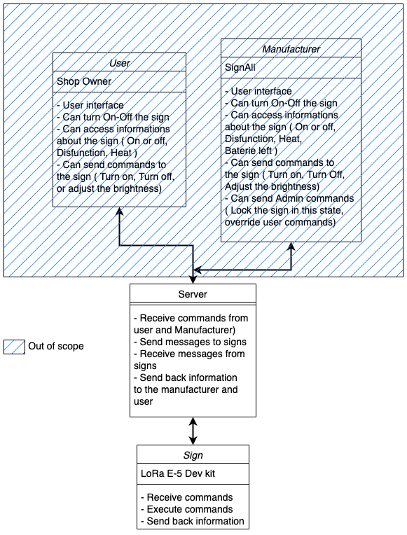

- [1 / GENERAL](#1--general)
  - [1.1 / Project Description](#11--project-description)
    - [1.1.1 / Background](#111--background)
    - [1.1.2 / Purpose](#112--purpose)
    - [1.1.3 / Assumptions and Constraints](#113--assumptions-and-constraints)
    - [1.1.4 / Interfaces to External Systems](#114--interfaces-to-external-systems)
  - [1.2 / Points of Contact](#12--points-of-contact)
- [2 / FUNCTIONAL REQUIREMENTS](#2--functional-requirements)
  - [2.1 / Functional Process Requirements](#21--functional-process-requirements)
- [3 / OPERATIONAL REQUIREMENTS](#3--operational-requirements)
  - [3.1 / Security](#31--security)
  - [3.2 / System Availability](#32--system-availability)
  - [3.3 / Energy consumption](#33--energy-consumption)
  - [3.4 / Performance](#34--performance)
  - [3.5 / Data Retention](#35--data-retention)
  - [3.6 / Data transmission](#36--data-transmission)
- [4 / FEATURES](#4--features)
  - [4.1 / Turn On/Off](#41--turn-onoff)
  - [4.2 / Adjust the brightness](#42--adjust-the-brightness)
  - [4.3 / See Sign information](#43--see-sign-information)
  - [4.4 / Battery lifetime check](#44--battery-lifetime-check)
  - [4.5 / Lock instructions](#45--lock-instructions)
- [5 / REQUIREMENTS TRACE ABILITY MATRIX](#5--requirements-trace-ability-matrix)
- [6 / Personaes](#6--personaes)
  - [6.1 / Manufacturer](#61--manufacturer)
  - [6.2 / Technician](#62--technician)
  - [6.3 / Shop Owner](#63--shop-owner)
- [7 / GLOSSARY](#7--glossary)

# 1 / GENERAL

## 1.1 / Project Description

This project is made to make all signage from the company Signall smart.
This device need to adapt to existing sign and be compatible with new signs.

### 1.1.1 / Background

The company Signall is looking for a prototype to make their electric sign smart, and to be able to control them remotely.
So they contacted ALGOSUP in order to have a proof of concept or a prototype.

### 1.1.2 / Purpose

The purpose of this project is to be able to turn on and off the sign remotely.
Being able to turn it On and Off will also result in the respect of ecological issues.
Signall also needs a way to know if the sign is on or off in order to know if the signage is not broken.
Currently they have no other way to check if the sign is on or off than to go to the sign and check it.

### 1.1.3 / Assumptions and Constraints

Assumptions are future situations, beyond the control of the project, whose outcomes influence the success of a project.  Constraints are limitations on the project that are beyond the control of the project team.  The following assumptions and constraints apply to this project:

Assumptions:

- Availability of the hardware
- Developments in future technologies
  
Constraints:

- Governmental regulations
- Strategic decisions
- Budgetary constraints
- Competitive constraints
  
### 1.1.4 / Interfaces to External Systems

This software will receive data from outside the system.
We are not in charge of the back end of this data, we are just in charge of receiving this messages and send them to the sign.

We are also in charge of sending back anwser to the back end.

## 1.2 / Points of Contact

Here is the list of the principals points of contact for this project:

Entity | Rank | Name
----------|------------- | -------------
ALGOSUP | Project Manager | Aurélien Fernandez
ALGOSUP | Technical Lead | Paul Maris
ALGOSUP | Program Manager | Guillaume Rivière
SignAll | Client | Franck Jeannin

# 2 / FUNCTIONAL REQUIREMENTS

## 2.1 / Functional Process Requirements

Both sides of Manufacturer and User ( Shop owner ) will have a user interface to control the sign. **( Out of our scope)**

But for testing, we will need to simulate the backend and the user interface.
The user interface will be simulated by sending messages to the board without interface.( Console commands )

  

# 3 / OPERATIONAL REQUIREMENTS

## 3.1 / Security

Beside the manufacturer and the Shop owner, nobody can access the sign.
Here is a list of the security requirements:

| Action | Manufacturer | Shop Owner |
|----------|-------------| ------------|
| Turn On/Off | X | X |
| Adjust the brightness | X | X |
| See Sign information | X | X |
| Define Auto turn off Hours | X | X |
| Access battery informations | X |  |
| Lock instructions | X |  |

## 3.2 / System Availability

The application must be available 24/7.
But won't be used 24/7. It will be used on user demands.
The application will answer the user demands and idle most of the time.

## 3.3 / Energy consumption

**TBD With Client**

3 solutions come to us:

- Run on battery
- Run on sector
- Run on battery only when necessary

------------------------------
Running on battery:

- Battery have to be changed every 6 month to 1 year
- Can run even if there is an electric shortage
- Latency in informations of the sign ( up to 3 hours)
- Latency on the sended commands up to 15 minutes
- Limitation on features
- Need a way to check battery levels

------------------------------
Running on sector:

- Battery doesn't need maintenance
- Doesn't work in the case of electric shortage
- Latency of 15 mins in informations of the sign
- Latency of a few minutes of the sended commands ( Depending on the network usage at this time)
- Can add features as needed

------------------------------
Running on battery only when ncessary:

- Battery need maintenance only in the case of a failure
- Can run in the case of an electric shortage
- Need more development
- Need more components
- Latency depends on the current mode and the network usage

## 3.4 / Performance

**TBD with Client Depending on the Battery Section**

For saving energy consumption, the queries will be send every 3 hours.
That result in the lowest performance possible with as much recent informations as possible.
It will also check every 15 minutes if the sign have to execute a command or not.

------------------------------

To have a reactive sign, we need the software to be awake and ready at any time.
The queries will be send every 15 minutes.
That result of the hardware to be awake at any time to be ready to execute commands.

## 3.5 / Data Retention

**TBD with Client**

No data will be stored in the application as we don't need to store data, we only need to send and receive data.
The data send will be retreived by the sensors, sended, and deleted instantly.

------------------------------

The hardware will store data every 15 minutes for a period of 3 hours before sending everythings to the server.
After sending its data, it will be deleted.

## 3.6 / Data transmission

**TBD with Client**

Data will be transmitted to the server every 15 minutes.

------------------------------

Data will be transmited every 3 hours to the server.

The communication process we are going to use is the LoRaWAN protocol.
LoraWAN is a protocol based on radio frequencies.
LoraWAN is a low power wide area network protocol designed to allow long range communication at low bit rates.
It's designed to not use a lot of energy and to be able to communicate over a long distance, long distance is about 100 Km.

# 4 / FEATURES

## 4.1 / Turn On/Off

This feature describe the facts that it will be possible to turn on or off the sign remotely.
Taking in consederation that you could be near the sign or not, you will be able to turn it on or off.

## 4.2 / Adjust the brightness

**TBD with Client**

This feature describe the facts that it will be possible to adjust the brightness of the sign remotely.
Adjusting means being able to control the brightness of the sign in percentage.

------------------------------

This feature describe the facts that it will be possible to adjust the brightness of the sign remotely.
Adjusting means being able to control the brightness of the sign with 3 modes: Low, Medium, High.

- Low: 40%
- Medium: 60%
- High: 100%

## 4.3 / See Sign information

This feature describe the facts that it will be possible to see the informations of the sign remotely.
The informations are:

- State of the sign ( On / Off )
- Brightness of the sign ( Percentage )
- Battery level ( Percentage )
- Sign temperature ( Check Overheating )
- Failure ( If the sign is broken )

## 4.4 / Battery lifetime check

**TBD with Client**

This feature describe the facts that it will be possible to check the battery lifetime of the sign remotely.
The battery lifetime will be check every 3 hours.
This will help the manufacturer to know when to change the battery.

## 4.5 / Lock instructions

For maintenance, the sign might need to be locked and unable to receive commands until the maintenance is done.
This includes locking down the sign for a period of time for everyone except the repairman finish.

# 5 / REQUIREMENTS TRACE ABILITY MATRIX

The following table shows the traceability of the requirements to the functional and non-functional requirements.

| Requirement | Functional | Non-Functional |
|----------|-------------| ------------|
| Turn On/Off | [4.1 / Turn On/Off](#41--turn-onoff) | [3.1](#31--security) |
| Adjust the brightness | [4.2](#42--adjust-the-brightness) | [3.1](#31--security) |
| See Sign information | [4.3](#43--see-sign-information) | [3.1](#31--security) |
| Access battery informations | [4.4](#44--battery-lifetime-check)) | [3.1](#31--security) |
| Lock instructions | [4.5](#45--lock-instructions) | [3.1](#31--security) |
| Send data to backend | [2.2](#22--functional-process-requirements) | [3.1](#31--security) |
| Receive data from backend | [2.2](#22--functional-process-requirements) | [3.1](#31--security) |
| Send data to backend | [3.6](#36--data-transmission) | [3.1](#31--security) |
| Receive data from backend | [3.6](#36--data-transmission) | [3.1](#31--security) |
| Data Retention |  | [3.5](#35--data-retention) |
| System Availability |  | [3.3](#33--system-availability) |
| Performance |  | [3.4](#34--performance) |
| Security |  | [3.1](#31--security) |

# 6 / Personaes

## 6.1 / Manufacturer

**Name:** Pierre Dupont

**Job Title:** CEO

**Live:** Paris, France

**Work:** Paris, France

**Use case**
Pierre might want to know which signs are currently working in France.

## 6.2 / Technician

**Name:** Jean Dupond

**Job Title:** Sign Technician

**Live:** Paris, France

**Work:** Everywhere, France

**Use case**
Jean need to know which sign isn't currently working in France.
He also need to know which sign is having issue to he can repair it as soon as possible.
He doesn't want to go to a sign that have no problems.
He could also need to turn on of off the sign for maintenance or installation.

------------------------------

**Name:** Eric Francois

**Job Title:** Sign Technician

**Live:** Vierzon, France

**Work:** Everywhere, France

**Use case**
Eric need to know which sign isn't currently working in France.
He also need to know which sign is having issue to he can repair it as soon as possible.
He doesn't want to go to a sign that have no problems.
He could also need to turn on of off the sign for maintenance or installation.

## 6.3 / Shop Owner

**Name:** Patrik Balecanie

**Job Title:** Shop Owner

**Live:** Vierzon, France

**Work:** Vierzon, France

**Use case**
Patrik doesn't like the feature of automatic light on/off.
He prefer to turn it off manually when he close the shop and on when he open it.
He is an ecological adept and he'd like to be able to adjust the brightness of the sign to save energy.

------------------------------

**Name:** Jean Moretty

**Job Title:** Shop Owner

**Live:** Paris, France

**Work:** Vierzon / Paris / Montpellier, France

**Use case**
Jean have 3 shop and can't be everywhere at the same time.
Jean want a wait to check if the manager of each shop is doing his job with the sign. 
And set automatic light on/off for each shop as they doesn't have the same closing hour.

# 7 / GLOSSARY

Here is the list of the terms used in this document:

Term | Definition
----------|-------------
Manufacturer | The company that makes the sign
Shop Owner | The person who owns the shop and the sign
Sign | The LED sign
Backend | The server that we receive and send messages to
User Interface | The interface that the user will use to control the sign
User | The person who will use the interface to control the sign
Network | The network that will be used to send and receive messages
Queries | The requests sent to the server
LoraWAN | The network protocol used to send and receive messages
Bites | The unit of information
bites rate | The number of bits that can be sent per second

