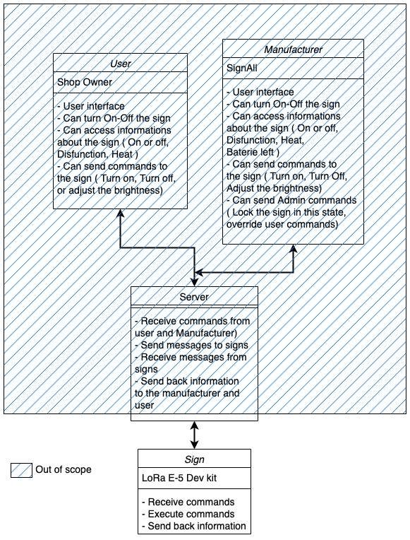

- [1 / GENERAL](#1--general)
  - [1.1 / Project Description](#11--project-description)
    - [1.1.1 / Background](#111--background)
    - [1.1.2 / Purpose](#112--purpose)
    - [1.1.3 / Assumptions and Constraints](#113--assumptions-and-constraints)
    - [1.1.4 / Interfaces to External Systems](#114--interfaces-to-external-systems)
  - [1.2 / Points of Contact](#12--points-of-contact)
- [2 / FUNCTIONAL REQUIREMENTS](#2--functional-requirements)
  - [2.1 / Data Requirements](#21--data-requirements)
  - [2.2 / Functional Process Requirements](#22--functional-process-requirements)
- [3 / OPERATIONAL REQUIREMENTS](#3--operational-requirements)
  - [3.1 / Security](#31--security)
  - [3.2 / Data Currency](#32--data-currency)
  - [3.3 / System Availability](#33--system-availability)
  - [3.4 / Performance](#34--performance)
  - [3.5 / Data Retention](#35--data-retention)
- [4 / REQUIREMENTS TRACE ABILITY MATRIX](#4--requirements-trace-ability-matrix)
- [5 / Personaes](#5--personaes)
  - [5.1 / Manufacturer](#51--manufacturer)
  - [5.2 / Technician](#52--technician)
  - [5.3 / Shop Owner](#53--shop-owner)
- [6 / GLOSSARY](#6--glossary)

# 1 / GENERAL
## 1.1 / Project Description
This project is made to make all signage from the company Signall smart.
### 1.1.1 / Background
The company Signall is looking for a prototype to make their electric sign smart, and to be able to control them remotely.
So they contacted ALGOSUP in order to have a proof of concept or a prototype.
### 1.1.2 / Purpose
The purpose of this project is to be able to turn on and off the sign remotely. 
Being able to turn it On and Off will also result in the respect of ecological issues.
Signall also needs a way to know if the sign is on or off in order to know if the signage is not broken.
Currently they have no other way to check if the sign is on or off than to go to the sign and check it.
### 1.1.3 / Assumptions and Constraints
Assumptions are future situations, beyond the control of the project, whose outcomes influence the success of a project.  Constraints are limitations on the project that are beyond the control of the project team.  The following assumptions and constraints apply to this project:

Assumptions: 
- Availability of the hardware
- Developments in future technologies
  
Constraints:
- Governmental regulations
- Strategic decisions
- Budgetary constraints
  
### 1.1.4 / Interfaces to External Systems
This software will receive data from outside the system.
We are not in charge of the back end of this data, we are just in charge of receiving this messages and send them to the sign.

We are also in charge of sending back anwser to the back end.
## 1.2 / Points of Contact
Here is the list of the principals points of contact for this project:

Entity | Rank | Name
----------|------------- | -------------
ALGOSUP | Project Manager | Aurélien Fernandez
ALGOSUP | Technical Lead | Paul Maris
ALGOSUP | Program Manager | Guillaume Rivière
SignAll | Client | Franck Jeannin

# 2 / FUNCTIONAL REQUIREMENTS

## 2.1 / Data Requirements
The system must be able to turn on or off the sign depending on the message received from the backend.
The system must be able to send a message to the backend to tell if the sign is on or off.

## 2.2 / Functional Process Requirements

Both sides of Manufacturer and User ( Shop owner ) will have a user interface to control the sign. **( Out of our scope)**

But for testing, we will need to simulate the backend and the user interface.
The user interface will be simulated by sending messages to the board without interface.( Console commands ) 

 
  

# 3 / OPERATIONAL REQUIREMENTS

## 3.1 / Security

Beside the manufacturer and the Shop owner, nobody can access the sign.
Here is a list of the security requirements:

| Action | Manufacturer | Shop Owner |
|----------|-------------| ------------|
| Turn On/Off | X | X |
| Adjust the brightness | X | X |
| See Sign information | X | X |
| Define Auto turn off Hours | X | X |
| Access baterie informations | X |  |
| Lock instructions | X |  |
| Override instructions | X |  |

## 3.2 / Data Currency
The data don't need to be updated in real time.
We only need informations every few hours every days.
## 3.3 / System Availability
The application must be available 24/7.
But won't be used 24/7. It will be used on user demands.
The application will answer the user demands and idle most of the time.

## 3.4 / Performance

The application doesn't need a short time of response for queries.
Since we only need a few updates a day, we don't need queries to be fast.

For the message transmitted, they also don't have to be huge.
Because we expect the user to use the application only 2 or 3 times a day, messages will contains the maximum on informations.

## 3.5 / Data Retention
No data will be stored in the application as we don't need to store data, we only need to send and receive data.
And the data send will be retreived by the sensors.

# 4 / REQUIREMENTS TRACE ABILITY MATRIX
The following table shows the traceability of the requirements to the functional and non-functional requirements.

| Requirement | Functional | Non-Functional |
|----------|-------------| ------------|
| Turn On/Off | [2.2](#22--functional-process-requirements) | [3.1](#31--security) |
| Adjust the brightness | [2.2](#22--functional-process-requirements) | [3.1](#31--security) |
| See Sign information | [2.2](#22--functional-process-requirements) | [3.1](#31--security) |
| Access baterie informations | [2.2](#22--functional-process-requirements) | [3.1](#31--security) |
| Lock instructions | [2.2](#22--functional-process-requirements) | [3.1](#31--security) |
| Override instructions | [2.2](#22--functional-process-requirements) | [3.1](#31--security) |
| Send data to backend | [2.2](#22--functional-process-requirements) | [3.1](#31--security) |
| Receive data from backend | [2.2](#22--functional-process-requirements) | [3.1](#31--security) |
| Send data to backend | [2.2](#22--functional-process-requirements) | [3.1](#31--security) |
| Receive data from backend | [2.2](#22--functional-process-requirements) | [3.1](#31--security) |
| Data Retention |  | [3.5](#35--data-retention) |
| Data Currency |  | [3.2](#32--data-currency) |
| System Availability |  | [3.3](#33--system-availability) |
| Performance |  | [3.4](#34--performance) |
| Security |  | [3.1](#31--security) |

# 5 / Personaes

## 5.1 / Manufacturer

**Name:** Pierre Dupont

**Job Title:** CEO

**Age:** 45

**Use case** 
Pierre might want to know if the sign is currently working, or if it is broken. So he could know which sign is on or off.

## 5.2 / Technician

**Name:** Jean Dupond

**Job Title:** Sign Technician

**Age:** 35

**Use case**
Jean might want to know if the sign is currently working, or if it is broken. So he could know which sign is on or off and know wich one to repair.
He could also need to turn on of off the sign for maintenance or installation.

## 5.3 / Shop Owner

**Name:** Patrik Balecanie

**Job Title:** Shop Owner

**Age:** 38

**Use case**
Patrik might want to turn on the sign on open, and turn it off on close. He might also want to adjust the brightness of the sign depending on the outside brightness.

# 6 / GLOSSARY
Here is the list of the terms used in this document:

Term | Definition
----------|-------------
Manufacturer | The company that makes the sign
Shop Owner | The person who owns the shop and the sign
Sign | The LED sign
Backend | The server that we receive and send messages to
User Interface | The interface that the user will use to control the sign
User | The person who will use the interface to control the sign

